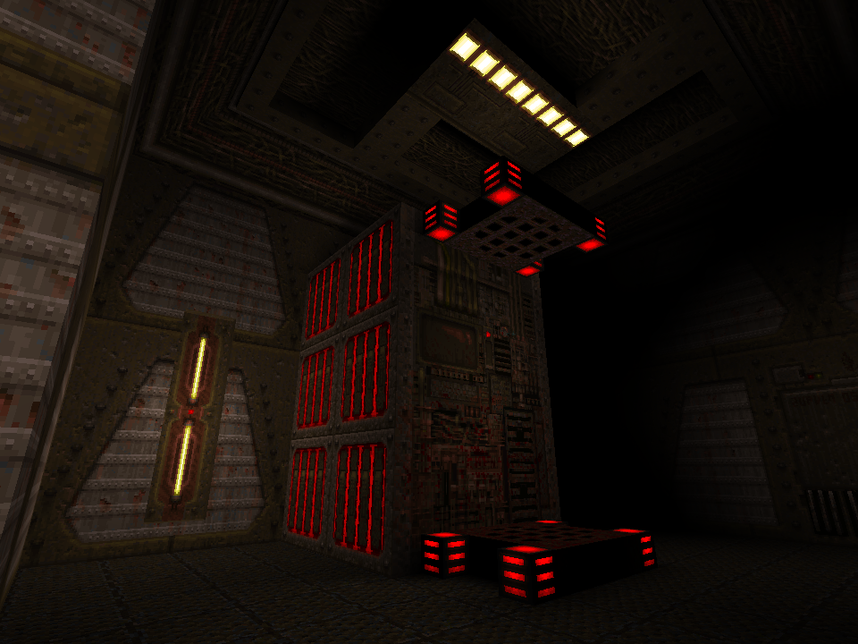
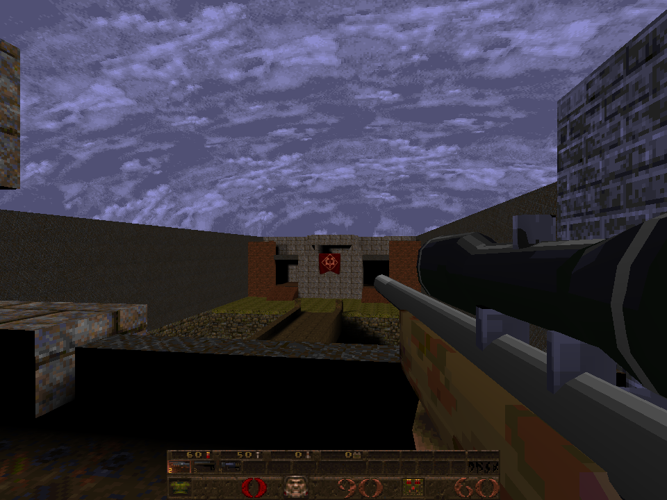
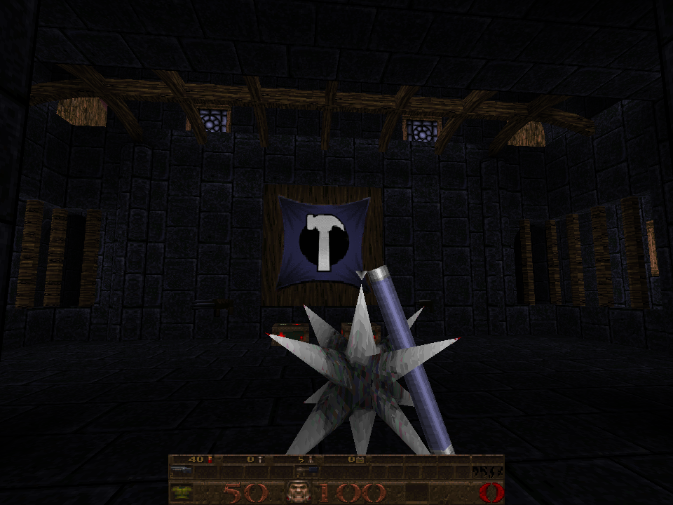
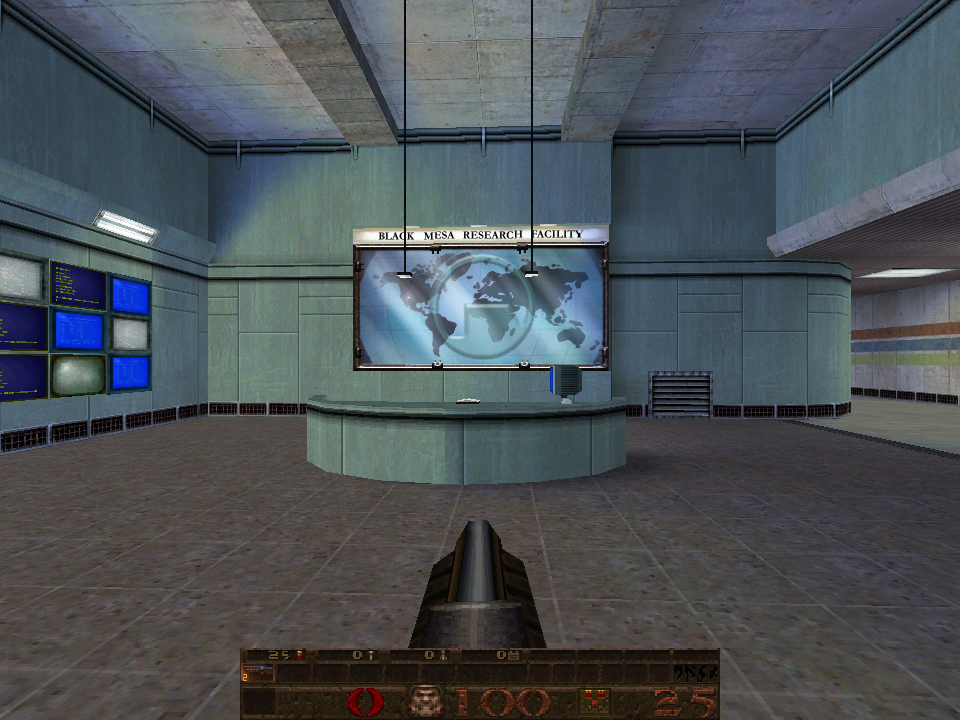

# Quake

An experimental fork of Id Software's Quake engine.

All of the multiplayer enhancements of QuakeWorld have been merged into the original engine!

<p align="center">




</p>

## Features

- OGG music playback
- Luminescent textures, a software feature omitted from the original OpenGL renderer
- Virtual machine capable of running both Quake and QuakeWorld game code
- GoldSrc/Half-Life level and texture support

## Building

Install the dependencies:

`apt-get install libsdl2-dev libopenal-dev`

Clone the source code and compile the engine:

```
git clone https://github.com/Toodles2You/quake.git

cd quake

make INSTALL_DIR=<path/to/quake> release install
```

## License

The code is all licensed under the terms of the GPL (gnu public license). You should read the entire license, but the gist of it is that you can do anything you want with the code, including sell your new version. The catch is that if you distribute new binary versions, you are required to make the entire source code available for free to everyone.

All of the Quake data files remain copyrighted and licensed under the original terms, so you cannot redistribute data from the original game, but if you do a true total conversion, you can create a standalone game based on this code.

See [LICENSE.md](LICENSE.md) for the full license.
